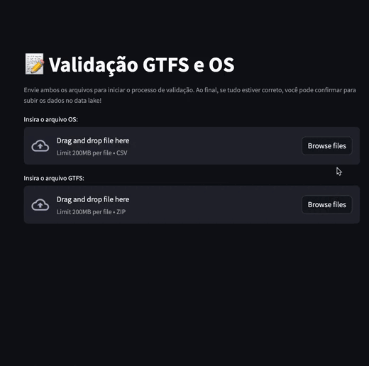

# gtfs-validator

Aplicativo web para validação do GTFS e Ordem de Serviço (OS) da rede municipal de transporte público da cidade.



## Desenvolvimento

Crie um arquivo com `.env` na raiz do seu repositório local com as seguintes credenciais:

```env
export VAULT_URL="https://vault.dados.rio"
export VAULT_TOKEN="<token>"
```

Para rodar o app, instancie as variáveis de ambiente primeiro:

```sh
source .env
streamlit run src/app.py
```
